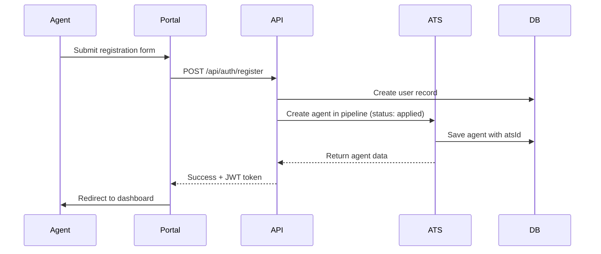
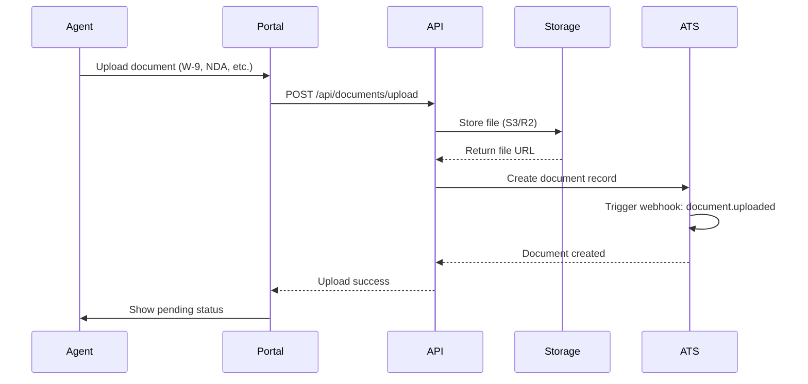
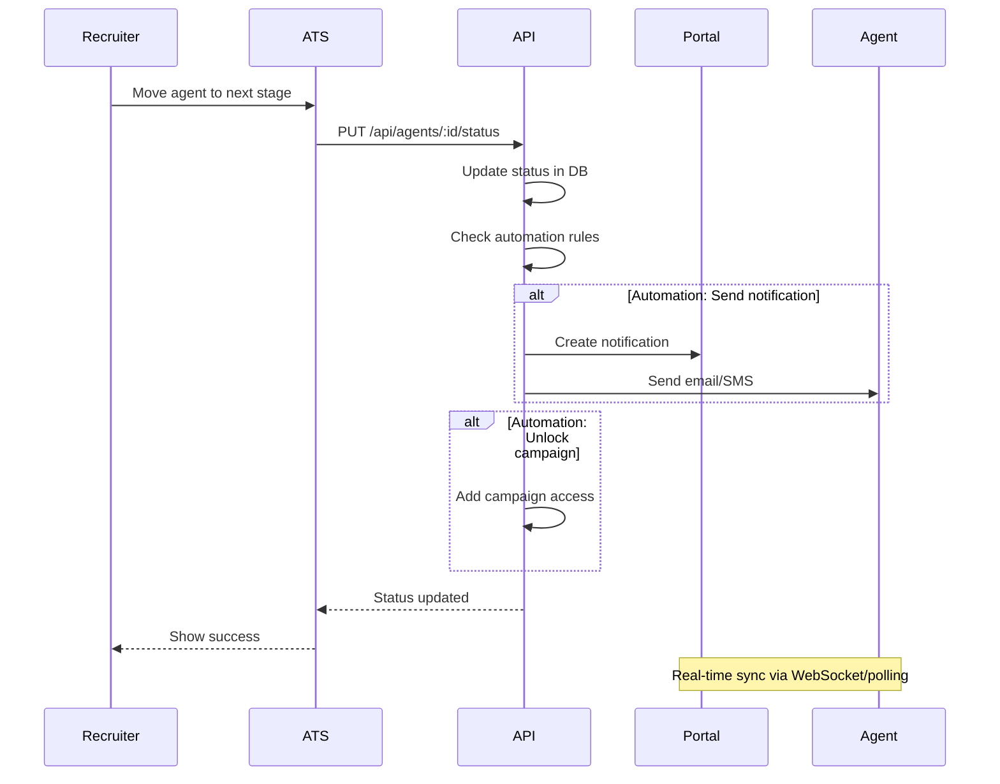
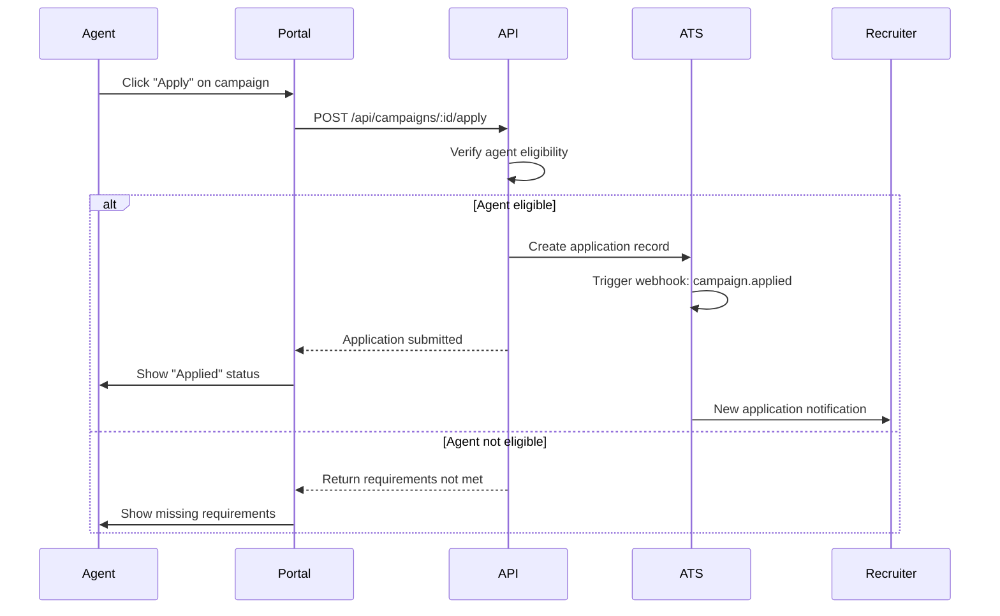
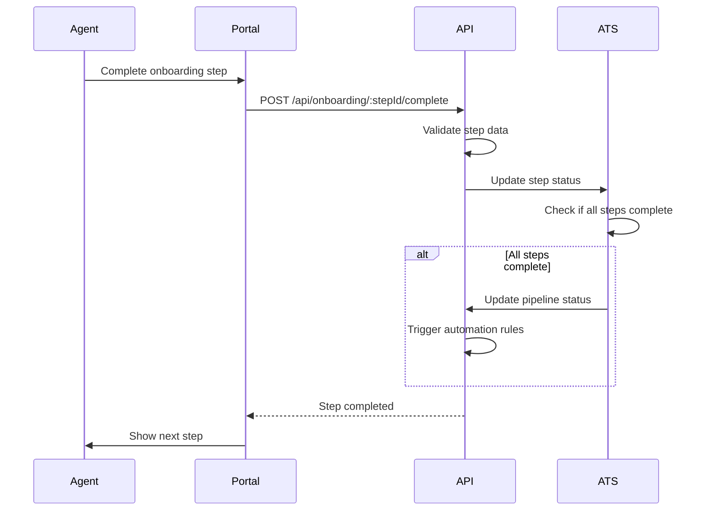

# Integration Flows: Portal ↔ ATS

## 1. Agent Registration Flow

## 2. Document Upload Flow

## 3. Pipeline Status Change Flow

## 4. Campaign Application Flow

## 5. Onboarding Step Completion Flow

## Key Webhook Events

| Event | Trigger | Data Payload |
|-------|---------|--------------|
| `agent.created` | New registration | `{ agentId, email, atsId }` |
| `agent.status_changed` | Pipeline move | `{ agentId, oldStatus, newStatus, changedBy }` |
| `document.uploaded` | Doc upload | `{ agentId, documentId, type, status }` |
| `document.approved` | Doc review | `{ agentId, documentId, reviewedBy }` |
| `campaign.assigned` | Agent assigned | `{ agentId, campaignId, startDate }` |
| `evaluation.completed` | Assessment done | `{ agentId, evaluationType, score }` |

## API Endpoints Summary

### Authentication
| Method | Endpoint | Description |
|--------|----------|-------------|
| POST | `/api/auth/register` | Register new agent |
| POST | `/api/auth/login` | Agent/Admin login |
| POST | `/api/auth/refresh` | Refresh JWT token |
| GET | `/api/auth/me` | Get current user |

### Agents
| Method | Endpoint | Description |
|--------|----------|-------------|
| GET | `/api/agents` | List all agents (admin) |
| GET | `/api/agents/:id` | Get agent details |
| PUT | `/api/agents/:id` | Update agent profile |
| PUT | `/api/agents/:id/status` | Update pipeline status |

### Documents
| Method | Endpoint | Description |
|--------|----------|-------------|
| POST | `/api/documents/upload` | Upload document |
| GET | `/api/documents/:id` | Get document |
| PUT | `/api/documents/:id/status` | Approve/reject doc |

### Campaigns
| Method | Endpoint | Description |
|--------|----------|-------------|
| GET | `/api/campaigns` | List campaigns |
| POST | `/api/campaigns/:id/apply` | Apply to campaign |
| GET | `/api/campaigns/:id/agents` | Get campaign agents |

### Onboarding
| Method | Endpoint | Description |
|--------|----------|-------------|
| GET | `/api/onboarding/steps` | Get onboarding steps |
| POST | `/api/onboarding/:stepId/complete` | Complete step |

## Sync Mechanisms

1. **Real-time Updates**: WebSocket connections for instant UI updates
2. **Polling**: Fallback 30-second polling for status changes
3. **Webhooks**: Outgoing webhooks for external integrations
4. **Event Queue**: Redis-backed queue for async processing
